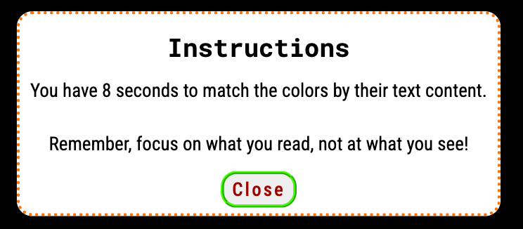
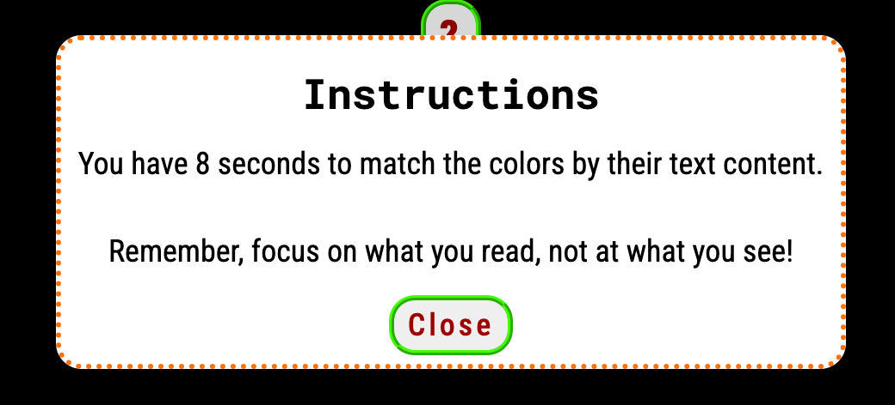
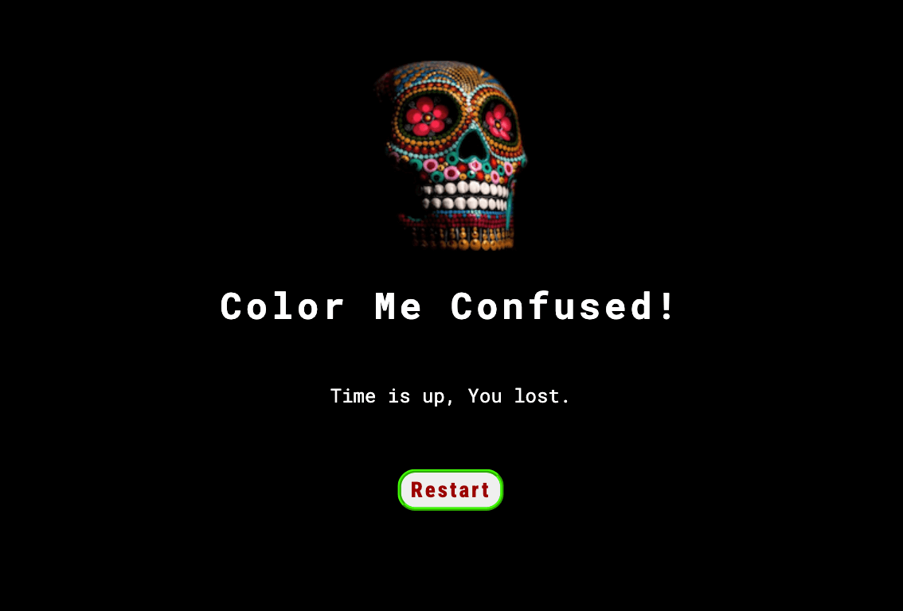
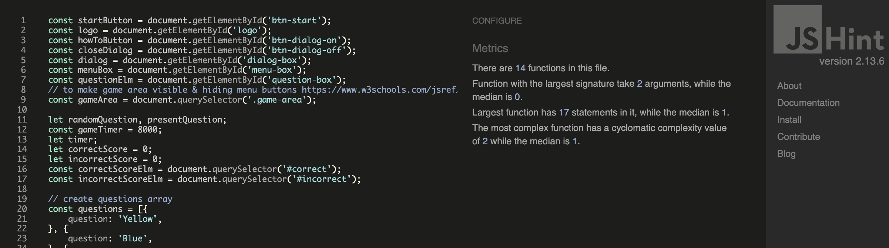

# Color Me Confused!

Color Me Confused! is a simple and fun brain-training game based on colors. Users can test their focus and cognitive skills while trying not to get confused by what they see but focusing on what they read.

Visit the deployed website [here](https://serrakd.github.io/color-me-confused/).

## Table Of Contents

1. [User Experience (UX)](#user-experience-ux)
2. [Wireframes](#wireframes)
3. [Color Scheme](#color-scheme)
4. [Features](#features)
   1. [Existing Features](#existing-features)
      - [Landing Page](#landing-page)
      - [Game Page](#game-page)
      - [Time Up Page](#time-up-page)
      - [Game Over Page](#game-over-page)
   2. [Features Left to Implement](#features-left-to-implement)
5. [Testing](#testing)
   1. [Manual Testing](#manual-testing)
   2. [Validator Testing](#validator-testing)
   3. [Accesibility Testing](#accesibility-testing)
   4. [Fixed Bugs](#fixed-bugs)
6. [Deployment](#deployment)
7. [Local Deployment](#local-deployment)
8. [Credits](#credits)
   1. [Content](#content)
   2. [Media](#media)
9. [Acknowledgements](#acknowledgements)

---

## User Experience (UX)

### Site Goals

- User-friendly website structure.
- A simple but intriguing design to attract user interest.
- A game without complex logic while still challenging and testing users' cognitive skills.

### Target Audiences

- Individuals who have interest in brain training games.
- Individuals who are interested in testing basic cognitive skills.
- Individuals who are looking for a simple but intriguing fun game.

### User Stories 

As a user, i want to;

- Have a positive and unique experience when visiting the website.
- Have easy access to starting the game and getting instructions.
- Play a game to have fun while testing my cognitive skills.
- Have a smooth experience.

## Wireframes

In the planning stage, I used Balsamiq wireframes to create the basic layout of the website. The final design evolved more than planned.

| Page  | Wireframe |
| ---- | :----: |
| Landing |  |
| Game |  |

## Color Scheme

- I decided to have a dark black background to balance the color game and have an intriguing minimalistic design.
- While keeping the color scheme minimalistic, I wanted the start and instruction button colors to match the logo.
- For the answer buttons, I used CSS gradients to ensure the color texts on the buttons are easily readable.

The __Contrast Grid__ is used to ensure the website is accessible.

## Features

The website consists of a Logo, heading, landing page, game page, time up page, and a game over page.

- It has a minimalistic, responsive and dark design to create curiosity for the user.

- The main goal of the website is to give users a chance to play a fun, simple but memorable brain training game.

## Existing Features

### __Color Me Confused Logo and Heading__

- At the top center of the page logo and heading are the first things the user sees. The logo was made specifically to get the attention of the user, create curiosity, and suit the title of the game.

- The logo has a hover effect and when clicked on brings the user to the landing page.

- The logo is consistent throughout all of the game pages.

 

### __Landing Page__

- The landing page includes the Color Me Confused logo, heading, start, and instruction buttons.

| Screen Size | Image |
| :---- | :----: |
| Small Screen |  |
| Medium Screen |  |
| Large Screen |  |

- __Start Button__

- When clicked, the start button takes the user to the game page and it has a hover effect.

- __Instruction Button__

-  To be consistent with the name of the game, the instruction button is a question mark, increasing the user's curiosity even further.

- When clicked, the button opens up a modal that includes instructions for the game and a close modal button.

- __Modal__

- The modal has clear but short instructions about how to play the game, information about countdown timer and gives a tip without being too obvious.

- It can be closed by clicking on the close button at the bottom of the modal.

| Screen Size | Image |
| :---- | :----: |
| Small Screen |  |
| Medium Screen |  |
| Large Screen |  |

### __Game Page__

- The game page consists of the game logo, question section, four answer buttons, and a score section.

- The user can play the game by matching the color questions with its text content buttons.

- User can only pick one answer per question, after the answer is selected game moves on to the next question until all questions are completed.

- Correct and incorrect scores are being calculated while the user is playing and can be found at the bottom center of the game area.

-  There is a countdown timer of 15 seconds built in the game page, so the user has to complete all the questions in the given timeline. Otherwise, it takes the user to the Time is Up page and the game is over.

| Screen Size | Image |
| :---- | :----: |
| Small Screen |  |
| Medium Screen |  |
| Large Screen |  |

### __Time Up Page__

- The Time Up page consists of the game logo, a paragraph that informs users that they didn't finish the game in the given timeline and that the game is over.

- User can easily return back to the landing page by clicking on the logo.

| Screen Size | Image |
| :---- | :----: |
| Small Screen |  |
| Medium Screen |  |
| Large Screen |  |

### __Game Over Page__

- The Game Over page consists of the game logo, a paragraph that informs users that the game is over and shows their final score.

- User can easily return back to the landing page by clicking on the logo.

| Screen Size | Image |
| :---- | :----: |
| Small Screen |  |
| Medium Screen |  |
| Large Screen |  |

### __Features Left to Implement__

- In the future, I would like to add a game difficulty option to let users challenge themselves further.
- Adding a multiplayer option for two users playing the game and testing their cognitive skills at the same time would create more challenge and competition. The user who finishes first with the highest score will win the game.

---

## Testing

### __Manual Testing__

- I tested manually all elements and pages on  Mac Book , HP, Iphone 12 using below browsers. 
- Also with Chrome Developer tools I tested different size devices, and found no errors.

| Browser | Pages | Logo | Buttons | Modal | Desktop| Mobile | Result |
| :----: | :----: | :----: | :----: | :----: | :----: | :----: |  :----: |
| Chrome| &check; | &check; | &check; | &check; | &check; | &check; | No issues |
| Safari | &check; | &check; | &check; | &check; | &check;| &check; | No issues |
| Edge | &check; | &check;| &check; | &check; | &check; | &check; | No issues |
| Mozilla Firefox | &check; | &check; | &check; | &check; | &check; | &check; | No issues |

---

### __Validator Testing__

- [V3C HTML](https://validator.w3.org/) , [V3C CSS](https://jigsaw.w3.org/css-validator/)  and [JShint](https://jshint.com/) were used for validator testing.

> HTML

| Page | [V3C HTML](https://validator.w3.org/) | Result |
| :----: | :----: | :----: |
| index.html |  |  No error found |

| Page | [V3C HTML](https://validator.w3.org/) | Result |
| :----: | :----: | :----: |
| 404.html |  |  No error found |

> CSS

| Page | [V3C CSS](https://jigsaw.w3.org/css-validator/) | Result |
| :----: | :----: |  :----: |
| style.css |  | No error found |

> JS

| Page | [JShint](https://jshint.com/) | Result |
| :----: | :----: |  :----: |
| script.js |  | No error found |

| *Returned Metrics For JavaScript* [JShint](https://jshint.com/) |
| :---- |
| There are 14 functions in this file. |
| Function with the largest signature take 2 arguments, while the median is 0. |
| Largest function has 17 statements in it, while the median is 1. |
| The most complex function has a cyclomatic complexity value of 2 while the median is 1. |

---

### __Accesibility Testing__

- [Page Speed](https://pagespeed.web.dev/) and [Lighthouse](https://developer.chrome.com/docs/lighthouse/overview) was used for accesibility testing.

| Device | [Page Speed](https://pagespeed.web.dev/) | [Lighthouse](https://developer.chrome.com/docs/lighthouse/overview) | Accesibility Score |
| :----: | :----: | :----: | :----: |
| Mobile |  |  | 100 |
| Desktop |  |  | 100 |

---

### __Fixed Bugs__

1. Fix the code for dialog box. [c30dca1](https://github.com/SerraKD/color-me-confused/commit/c30dca1c10b2c22c0c139053f27de0eceb300abf)
- Fixed by changing the calling id name in script.js 
2. Fix the code for questions array. [3d4b6a0](https://github.com/SerraKD/color-me-confused/commit/3d4b6a019261174413bbc34bdce933523fd46118)
- Fixed by adding commas between each question object. 
3. Fix the code for question element. [7e3e00f](https://github.com/SerraKD/color-me-confused/commit/7e3e00f0c05f69431ac0f7b92d2e972d6aba338d)
- Adding forgotton id in index.html resolved the issue.
4. Fix the code for button remove event listener. [b0168ac](https://github.com/SerraKD/color-me-confused/commit/b0168ac5cbc2f69a8e65f3055fa7ad2be5235409)
- Event listener for answer buttons was not being removed correctly. Removing arrow function and rewriting it as traditional function resolved the error. 
5. Fix the code for button event listener and select answer by moving them into startgame function. [eb7e7d5](https://github.com/SerraKD/color-me-confused/commit/eb7e7d56262234aa42500a1ce774e0c193c42518)
- When game starts and picked answer code was running multiple times it was having unnecessary loops.  Moving the answer button event listener, check correct answer and select answer function into start game resolved the error. 
6. Remove the manifest for favicon from index.html. [e3c8f40](https://github.com/SerraKD/color-me-confused/commit/e3c8f40cb73677f497b10547c182e2afe6b7feff)
- The manifest for favicon was creating an error in console. Removing it from index.html resolved the error. 
7. Fix the code for timer by putting it into startGame function.[43ea558](https://github.com/SerraKD/color-me-confused/commit/43ea5582f057bd0a7f37078eaa3ba392cd18fac0)
- The timer was starting to count down from the landing page, causing incorrect functioning. By adding it into start game function i ensured that timer starts with the game. 
8. Fix the code for open modal selector in style.css. [b822756](https://github.com/SerraKD/color-me-confused/commit/b822756c91f51c9528cce5fb6661962a1eee296a)
- Css validator was showing an error (Unknown pseudo-element or pseudo-class :modal )for dialog box selector. using devtools i managed to apply same styles with changing the selector name to dialog[open] . 
9. Fix the code for user scores, change it to class.[d307009](https://github.com/SerraKD/color-me-confused/commit/d307009399a2d9043483f19512b1547e59f33c8c)
- index.html had duplicate id for user-scores. by changing id to class in both index.html and style.css error was solved. 
10. Fix the answer button colors in style.css [709d016](https://github.com/SerraKD/color-me-confused/commit/709d01685b55f8fb55bd9b023a2dc8022662a0dd)
- While manual testing I realized that answer buttons had blue text on the deployed page on the mobile screen because the colors were not defined. Adding a text color black in CSS resolved the issue.

## Deployment

I used [Gitpod](https://gitpod.io/) to develop this website.

I deployed the website in early stages of develepment on [GitHub](https://github.com/) with following steps;

1. Log in to Github and go to projects' repository.
2. Find the Settings on the top of the repository and click.
3. On the left side of the screen, find Pages and select.
4. Under the Branch section, click on the dropdown that says none, and pick "Main" and click on save button.
4. The page is now deployed.

Visit the deployed website [here](https://serrakd.github.io/color-me-confused/).

## Local Deployment

__Fork__:

1. Log in to Github and go to projects' repository.
2. On the top right side of the page, click on _fork_ button.

__Clone__:

1. Log in to Github and go to projects' repository.
2. On the top of the file lists, click on _Code_ button.
3. Whether you want to use HTTPS, SSH key or Github CLI select it, and then click on copy.
4. Open the terminal, type **git clone** and paste the URL copied.
5. Press enter and local clone is now created.

## Credits

- All fonts were imported from [Google Fonts](https://fonts.google.com/).
- Wireframes made with [Balsamiq](https://balsamiq.com/).
- Logo was created using [favicon](https://favicon.io/).
- Information about Gradient effect in CSS from [W3schools](https://www.w3schools.com/css/css3_gradients.asp).
- [Am I responsive?](https://ui.dev/amiresponsive) was used for responsive mockup.
- [Eightshapes](https://contrast-grid.eightshapes.com/) was used for color contrast checking.
- To check the grammar of all text content, I used [Grammarly](https://app.grammarly.com/).
- [Tiny PNG](https://tinypng.com/) was used for file compression.
- [V3C HTML](https://validator.w3.org/) used for HTML validator testing.
- [V3C CSS](https://jigsaw.w3.org/css-validator/) used for CSS validator testing.
- [JShint](https://jshint.com/) used for JavaScript testing.
- [Dev Tools](https://developer.chrome.com/docs/devtools/) was used throughout the project for testing, troubleshooting, and styling.
> Below JS documents were used as studying and reference material;
- https://www.w3schools.com/jsref/met_document_queryselector.asp
- https://developer.mozilla.org/en-US/docs/Web/API/HTMLDialogElement/showModal
- https://developer.mozilla.org/en-US/docs/Web/JavaScript/Reference/Statements/try...catch
- https://www.w3schools.com/jsref/met_win_settimeout.asp
- https://stackoverflow.com/questions/42661936/whats-the-difference-between-math-random-0-5-and-math-random-0-5
- https://developer.mozilla.org/en-US/docs/Web/JavaScript/Reference/Functions/Arrow_functions

### Content

- The game title was created in collaboration with the amazing [Pi](https://pi.ai/).
- All content was written by me.

### Media

-  The photo used as logo and favicon taken from [Pexels](https://www.pexels.com/). [Photo by Chait Goli](https://www.pexels.com/photo/multicolored-skull-decor-1918290/).

## Acknowledgements

- I am deeply grateful to my Mentor Rory Patrick Sheridan, for his invaluable guidance, support, and great tips.
- Special thanks to my husband for his support and patience with me while I was learning JavaScript and preparing this project.